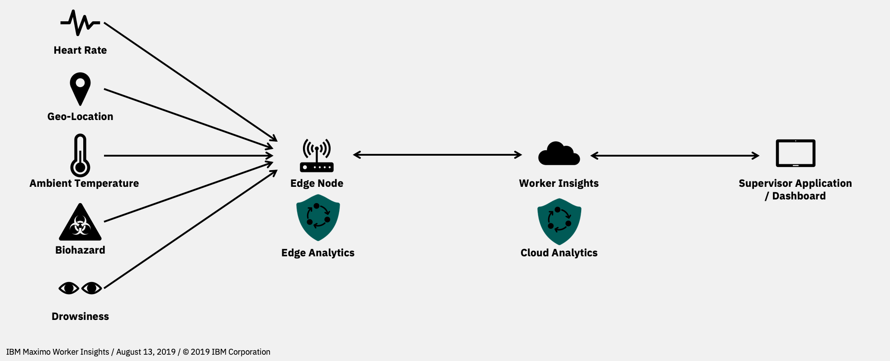

#  IBM® Maximo® Worker Insights
## Table of contents
|   Topics   |
|----------|
|[1. Introduction](##introduction)|
|[2. Installation](##installation)|

## Introduction
With edge analytics, Maximo Worker Insights (MWI) is able to support scenarios in which workers cannot use mobile phones.

- **Sensors**  
  Various sensors can connect to the edge node providing environmental and biometric information to the edge node.
- **Edge Node**  
  The edge node - also called edge gateway - is a computational unit with a Linux operating system, which is connected to the internet. Multiple sensors connect directly to the edge node. On the edge node IBM Maximo Worker Insights - Edge Analytics software stack is running. Shields are used to analyse the metrics from the sensors and create hazards if certain conditions are met.
- **Worker Insights on IBM Cloud**  
  Additionally to the edge analytics, the edge node integrates seamlessly with Maximo Worker Insights on IBM Cloud.
- **Supervisor Application / Dashboard**  
  Each hazard - regardless if it was detected by edge or cloud analytics - will be visualized on the mobile applications available for iOS and Android, as well as in the Dashboard.

### Further Reading
- IBM Maximo Worker Insights on [IBM Watson IoT](https://www.ibm.com/internet-of-things/solutions/enterprise-asset-management/worker-insights)
- IBM Maximo Worker Insights on [IBM Marketplace](https://www.ibm.com/us-en/marketplace/iot-safer-workplace)
- IBM Maximo Worker Insights on [IBM Knowledge Center](https://www.ibm.com/support/knowledgecenter/SSQNYQ_bas/worker-insights/kc_welcome_bas.html)

## Installation
### Pre-requirements
As a Business Partner, information (such as gateway credentials) is provided to you by the IBM Maximo Worker Insights team. Following information is needed:
- `WIOTP_ORG` - Watson IoT Platform organization
- `WIOTP_REGION` - Watson IoT Platform region. Possible values are: us, uk, ch, de, nl
- `WIOTP_DEVICE_TYPE` - Watson IoT Platform gateway type
- `WIOTP_DEVICE_ID` - Watson IoT Platform gateway id
- `WIOTP_DEVICE_TOKEN` - Watson IoT Platform gateway device token
- `MWI_TENANT` - Maximo Worker Insights tenant ID
- `MWI_CONTEXT` - Maximo Worker Insights organization
- `MWI_USER_ID` - Maximo Worker Insights user ID of the gateway
- `LOG_DNA_KEY` - LogDNA key if available

### Procedure
1. **Get the scripts**  
Clone the git repository by running following command:
  ```shell
  git clone git@github.com:ibm-watson-iot/mwi-edge-gateway.git
  ```
Either clone the scripts directly onto the edge node or clone it locally onto your computer and later transfer them
onto your edge node. For example by using the `scp` command.

2. **Set the variables**  
Open the file `envvars.sh` with a text editor of your choice. Enter the values listed in section [Pre-requirements]():
```shell
# *****************************  EDIT HERE ***************************** #
# Watson IoT Platform
WIOTP_ORG=""
WIOTP_REGION="" # us,uk,ch,de,nl
WIOTP_DEVICE_TYPE=""
WIOTP_DEVICE_ID=""
WIOTP_DEVICE_TOKEN=""
# Maximo Worker Insights
MWI_HOST=""
MWI_TENANT=""
MWI_CONTEXT=""
MWI_USER_ID=""
# LogDNA (optional)
LOG_TO_CLOUD=true
LOG_DNA_KEY=""
# **************************** EDIT END ******************************** #
```
When you are done editing the `envvars.sh`, save it and transfer the whole repository to the edge node.

3. **Become root user**  
On the edge node, switch to `sudo` or `root` user. For example, by executing the command:
```shell
su -
```
or
```shell
sudo su
```

4. **Make the script executable**  
To ensure that the script can be executed, make it executable by running following command:
```shell
chmod +x ./setup.sh
```

5. **Start the installation**
Start the installation procedure by executing following command:
```shell
./setup.sh
```
It will take a couple of minutes until the installation completes.

6. **Check if installation was successful**  
After the setup script finishes and exits without errors, wait for about 2 minutes. Then run the following command:
```shell
hzn agreement list
```
The output looks similar to the following snipped sample and indicates that Horizon successfully synchronised with the server and started the Docker containers according to the service definition.
```json
 [
  {
    "name": "db4_internetofthings.ibmcloud...",
    "current_agreement_id": "0e44521718adb0043f1dcc2314c805...",
    "consumer_id": "IBM/...",
    "agreement_creation_time": "2019-06-06 18:10:40 +0200 CEST",
    "agreement_accepted_time": "2019-06-06 18:10:47 +0200 CEST",
    "agreement_finalized_time": "",
    "agreement_execution_start_time": "",
    "agreement_data_received_time": "",
    "agreement_protocol": "Basic",
    "workload_to_run": {
      "url": "https://internetofthings.ibmcloud.com/service/iot-gateway-client",
      "org": "IBM-WorkerInsight",
      "version": "1.1.0",
      "arch": "arm64"
    }
  }
]
```
To see if the containers are running, you can execute the following command:
```shell
docker ps
```
You should see 3 containers running.
